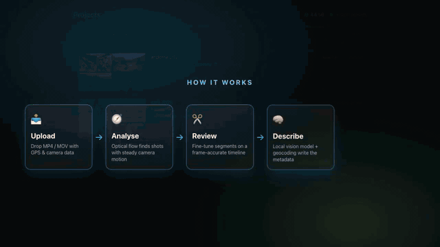
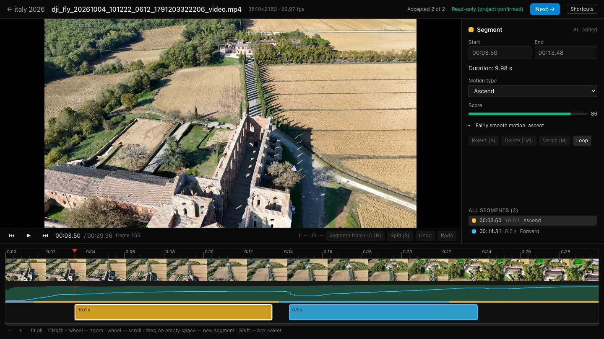
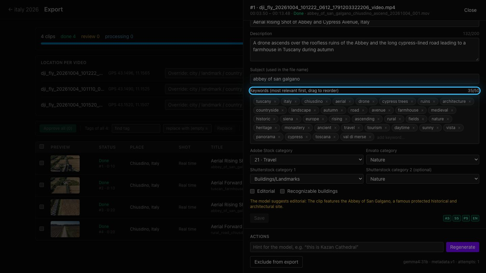
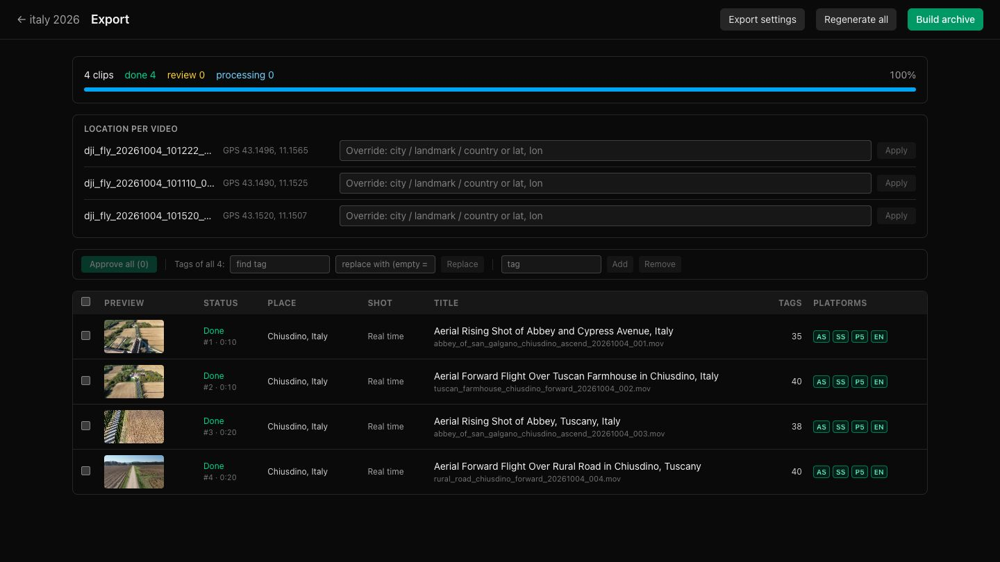
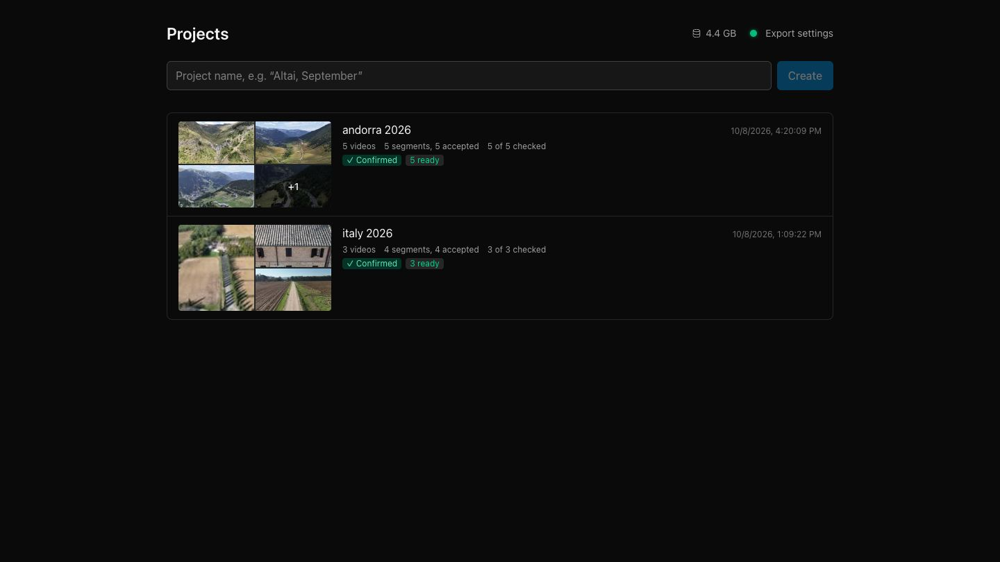
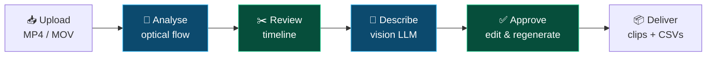

<div align="center">

# 🎬 Stock Video Editor

**The AI-powered editor that turns raw video footage into stock-ready clips, entirely on your own machine.**

Drop your footage in the browser. Get back trimmed clips, titles, descriptions, keywords and upload CSVs
for **Adobe Stock · Shutterstock · Pond5 · Envato**.



📘 **[User guide](docs/presentation/README.md)** · 🛠 **[Technical docs](docs/TECHNICAL.md)**

</div>

---

## Why

Preparing footage for stock sites is mostly busywork: scrubbing hours of video for clean shots,
cutting them, then writing titles and 50 keywords per clip in four different formats.

- ⏱ **Hours become minutes.** Computer vision finds every usable shot for you.
- 🧠 **Metadata that is right.** A vision model writes it from verified GPS, landmark and camera data instead of guessing.
- 🔒 **100% local AI.** Your footage never leaves your machine; the model runs in Ollama.

## Features

|                                 |                                                                                                                                                                                                                                                    |
| ------------------------------- | -------------------------------------------------------------------------------------------------------------------------------------------------------------------------------------------------------------------------------------------------- |
| 🧭 **AI shot detection**        | Dense optical flow tracks camera motion through the whole clip (sampled at 5 fps) and proposes 7–40 s shots with one steady camera move. It detects 12 motion types (forward, orbit, ascend, pan, tilt…) and rejects blur, bad exposure and jerks. |
| 🧠 **AI metadata writer**       | A local vision LLM (`gemma4:31b` via Ollama) looks at the sharpest frames and writes the title, description, ranked keywords, per-site categories and editorial flags. Its output is checked against a JSON Schema and retried when invalid.       |
| 📍 **Location intelligence**    | GPS from the file is turned into a city and nearby landmarks, and the app checks which landmarks are actually in the camera's view. The model may only name places it can verify.                                                                  |
| ✂️ **Human in the loop**        | A frame-accurate timeline editor, editable metadata, regenerate-with-a-hint ("this is Kazan Cathedral") and bulk keyword tools. Or turn on auto-approve.                                                                                           |
| 📦 **One-click delivery**       | Frame-accurate re-encodes (H.264 or ProRes), consistent file names, and a ZIP with ready-to-upload CSVs for 4 stock sites.                                                                                                                         |
| 🖥 **Runs anywhere Docker runs** | A single `docker compose` stack: web UI, API, ffmpeg and SQLite.                                                                                                                                                                                   |

## See it in action

| Review shots on the timeline                               | Let the AI describe every clip                           |
| ---------------------------------------------------------- | -------------------------------------------------------- |
|  |  |
| **Track every clip to delivery**                           | **Organise footage by project**                          |
|     |     |

## How it works



🔵 AI does the heavy lifting · 🟢 you stay in control. The **[user guide](docs/presentation/README.md)** walks through every step with screenshots.

## Quick start

You need [Docker](https://www.docker.com/products/docker-desktop/), Node.js 24+ with pnpm, and
[Ollama](https://ollama.com) with the vision model:

```bash
ollama pull gemma4:31b        # ~20 GB, one time
pnpm prod:up                  # build and start the stack
```

Open **http://localhost:8080**, create a project and drop your footage onto the window.

For development, run `pnpm install`, then `pnpm dev:api` and `pnpm dev:web` (→ http://localhost:4200).
See the **[technical docs](docs/TECHNICAL.md)** for configuration, environment variables and running without Docker.

## Documentation

|                                                  |                                                                                                                                       |
| ------------------------------------------------ | ------------------------------------------------------------------------------------------------------------------------------------- |
| 📘 **[User guide](docs/presentation/README.md)** | A visual walkthrough: segmentation, timeline review, how the AI writes metadata, location intelligence, export settings and delivery. |
| 🛠 **[Technical docs](docs/TECHNICAL.md)**        | Setup, Ollama configuration, the segmentation algorithm, API, manifest format, the export pipeline, CSV fields and tests.             |

## Built with

[Nx](https://nx.dev) · React · Fastify · OpenCV · ffmpeg · SQLite · [Ollama](https://ollama.com) + Gemma
