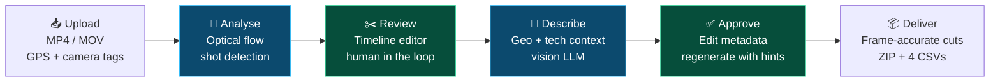
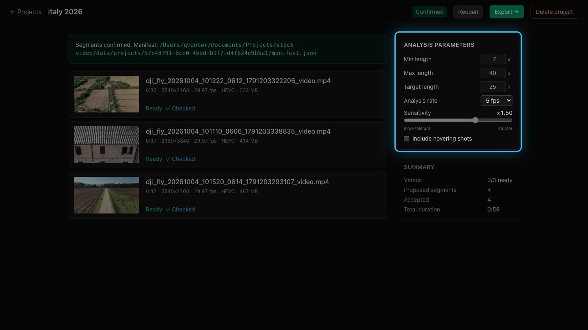
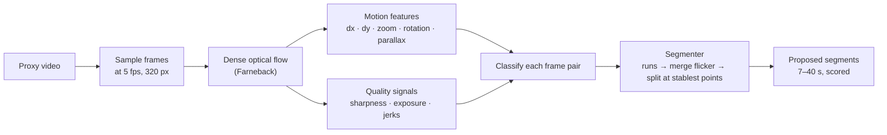
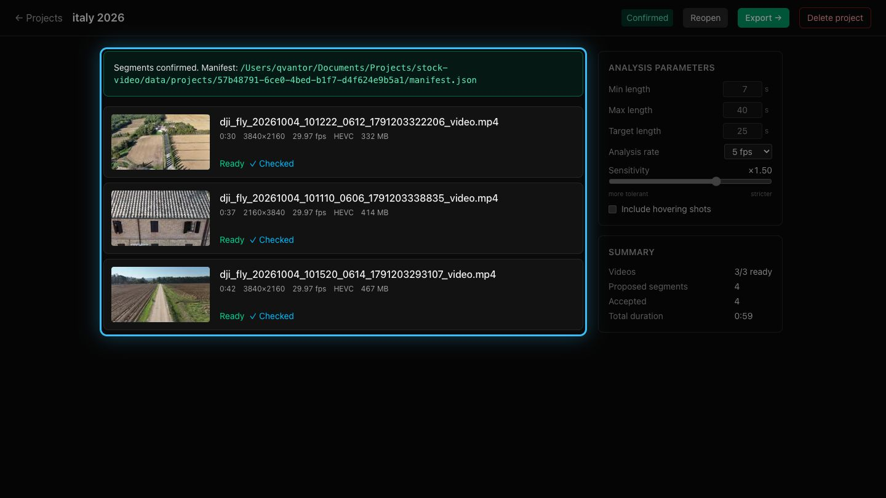
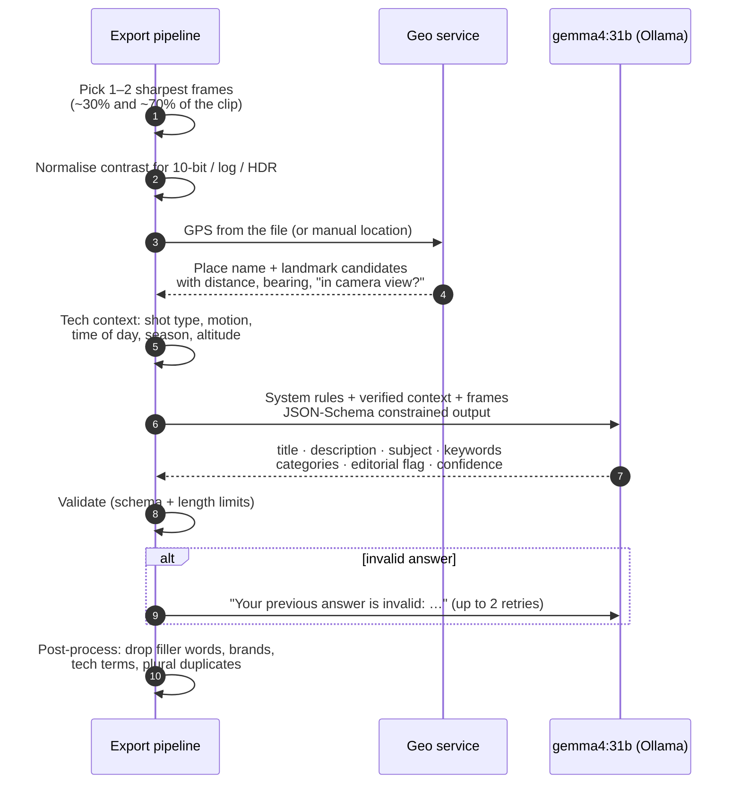
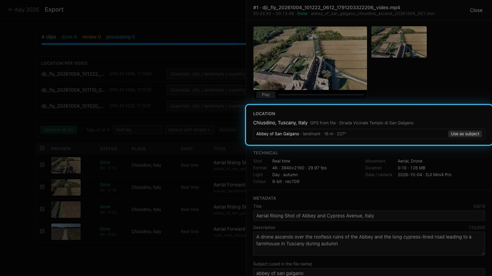
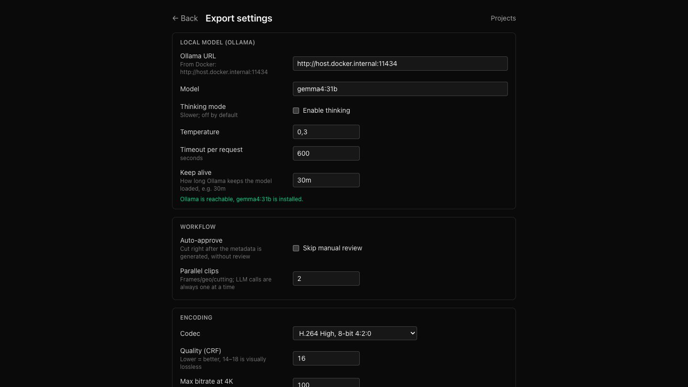
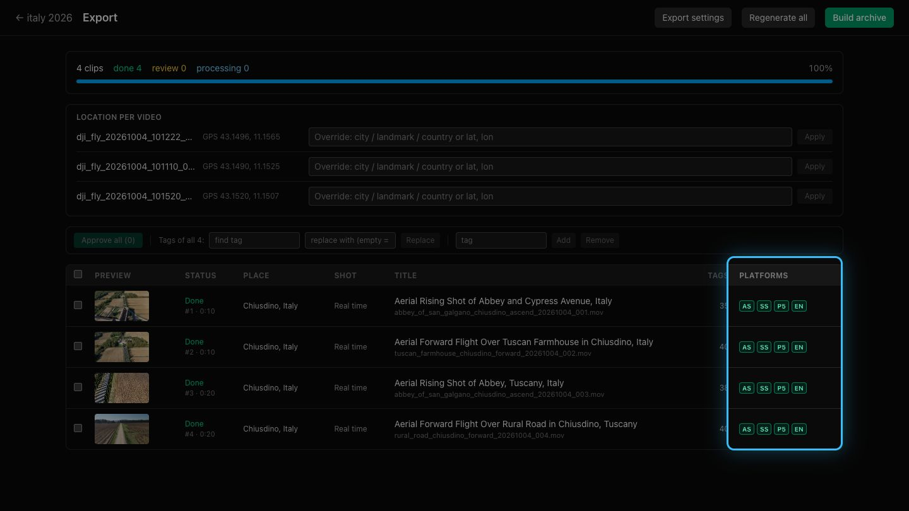
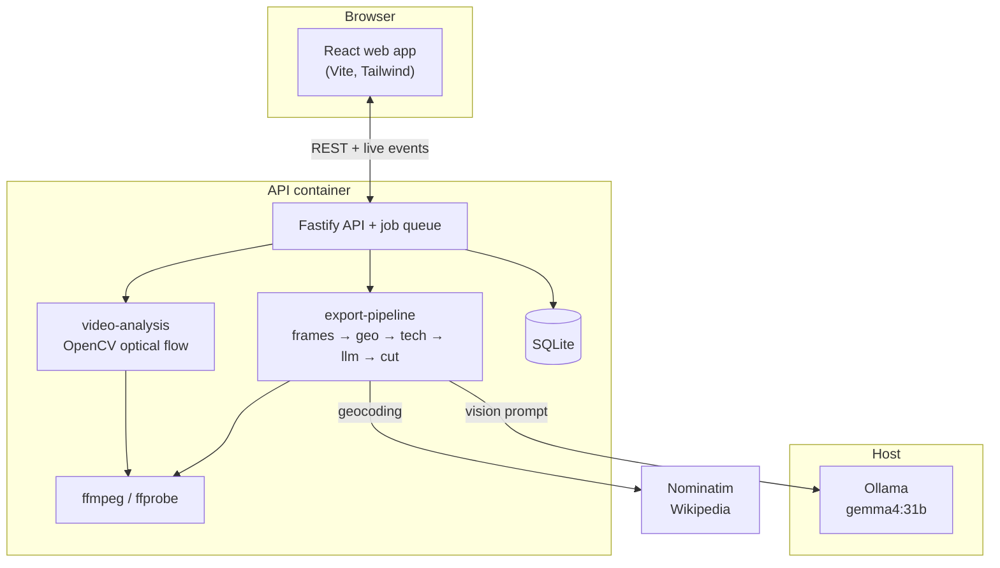

# Stock Video Editor — user guide

[← Overview](../../README.md) · [Technical docs](../TECHNICAL.md)

### An AI-powered editor that turns raw video footage into stock-ready clips, entirely on your machine

> Drop hours of footage in the browser. Computer vision finds the usable shots, a local vision
> language model writes the titles, descriptions and keywords, and the app delivers frame-accurate
> clips plus upload CSVs for **Adobe Stock, Shutterstock, Pond5 and Envato**.

|                 |                                                                                                                                                              |
| --------------- | ------------------------------------------------------------------------------------------------------------------------------------------------------------ |
| 🎯 **Problem**  | Preparing footage for stock sites means scrubbing hours of video, cutting clean shots and hand-writing metadata for four platforms, each with its own rules. |
| 🤖 **Solution** | An AI pipeline handles the boring 90%: shot detection, location research, metadata writing and per-site packaging. A human reviews and approves.             |
| 🔒 **Privacy**  | Everything runs locally: OpenCV in the API, `gemma4:31b` in Ollama. Only geocoding lookups go to OpenStreetMap and Wikipedia.                                |

---

## How it works



🔵 **AI steps:** computer vision and the language model. 🟢 **Human steps:** review and approval.

| Stage               | What happens                                                                           | Powered by                                 |
| ------------------- | -------------------------------------------------------------------------------------- | ------------------------------------------ |
| **1. Segmentation** | Raw videos are split into 7–40 s shots with one uniform camera move                    | OpenCV dense optical flow (Farneback)      |
| **2. Review**       | You check, trim, split or merge segments on a timeline, then confirm → `manifest.json` | React timeline editor                      |
| **3. Enrichment**   | Each segment gets location, landmarks and technical features                           | Nominatim, Wikipedia geosearch, ffprobe    |
| **4. Metadata**     | Title, description, ranked keywords, categories, editorial flag                        | Local vision LLM (`gemma4:31b` via Ollama) |
| **5. Delivery**     | Frame-accurate re-encode, per-site CSVs, ZIP archive                                   | ffmpeg                                     |

---

## 1 · Projects


- One project per trip or shoot. Drop MP4/MOV files anywhere on the window.
- Each project shows a 2×2 cover built from the footage sprites, plus status and segment counts.
- Duplicate uploads are detected. The storage indicator shows disk usage and cleans up files the app can rebuild.

---

## 2 · AI shot detection: computer vision on every frame



The analyser does not look for "pretty frames". It looks for **usable stock shots**: continuous
stretches where the camera performs **one clean, steady move**.



**12 motion classes** are detected automatically:

`forward` · `backward` · `pan_left` · `pan_right` · `tilt_up` · `tilt_down` ·
`orbit_left` · `orbit_right` · `ascend` · `descend` · `static` · `erratic`

- **Rejects bad footage:** blurred frames, bad exposure and sudden stick jerks break a segment.
- **Splits on speed jumps,** so an accelerating shot does not merge with a slow one.
- **Ignores label flicker:** short noisy class changes inside one move are merged back.
- **Cuts long moves at their most stable point** to fit your min/max/target length.
- **Tunable:** sensitivity, analysis rate, length limits and whether hovering shots are kept.

---

## 3 · Review on the timeline


The AI proposes segments and a human has the final say.

- A thumbnail strip, a **motion-speed curve** and **colour-coded segments** (yellow = ascend, blue = forward…).
- Each segment shows its motion type, **stability score** and a plain-English explanation, e.g. _"Fairly smooth motion: ascent"_.
- Frame-accurate editing: drag edges, I/O points, split (S), merge, undo/redo, box select, loop playback.
- Keyboard-first workflow: review a video, press **Next**, repeat.

---

## 4 · Confirm → manifest



Confirming locks the segments and writes `manifest.json`, the contract between stage 1
(segmentation) and stage 2 (export). The project can be reopened at any time, but reopening
discards the whole export: AI metadata, your edits and approvals, and encoded clips. Every clip
goes through the model again after the next confirm.

---

## 5 · AI metadata: what the model actually sees


Each clip runs through a **step pipeline**: frames → geo → tech → LLM → cut. LLM calls run
one at a time; the other steps run in parallel.



### Grounded, not hallucinated

The model is told only **verified facts**. This is the context block that was actually sent for the abbey clip:

```text
Location: Chiusdino, Tuscany, Italy (source: GPS from the video file).
Local name: Strada Vicinale Tempio di San Galgano.
Coordinates: 43.14949, 11.15579.
Nearby landmark candidates (closest first; "in view" = inside the camera field of view):
- Abbey of San Galgano (landmark), 16 m away, bearing 237°, in view: unknown
GPS altitude: 258 m above sea level.
Camera movement: ascending / rising (Aerial, Drone).
Shot type: real time.
Time of day: daytime.
Season: autumn.
Capture date: 2026-10-04.
Clip duration: 10 s.
```

_(Full address shortened. Taken from the request log in `data/llm-logs/`. The model answered in 23 s on the first attempt.)_

Rules baked into the prompt (versioned as `metadata.v1`):

- **Name a landmark only if** it is in the candidate list **and** matches what is visible; otherwise use generic terms.
- Report a **`placeConfidence`** (`high` / `medium` / `low` / `unknown`). With no GPS the model must not guess any place.
- No filler ("stunning", "amazing"), no technical keywords ("4k", "fps"), no brand names.
- Pick categories **only from the platforms' official lists**.
- Flag **recognisable buildings** and **suggest editorial** use with a reason.

---

## 6 · Location intelligence



- **Reverse geocoding** (OpenStreetMap Nominatim) turns the GPS track into _city, region, country_.
- **Landmark search** (Wikipedia geosearch) finds nearby points of interest and ranks them by distance.
- When the flight direction gives a **camera heading**, landmarks are checked against the **camera's field of view** and visible ones rank first.
- One click, **"Use as subject"**, makes a landmark the clip's subject and file name.
- Wrong GPS or none at all? Override per video with a city, landmark or `lat, lon`.
- **Technical features** come from metadata, not guesses: 4K / 29.97 fps, real time vs slow-mo / timelapse / hyperlapse, light, colour profile, capture date, camera model.

---

## 7 · The output: reviewed, editable, per-platform


What `gemma4:31b` produced for this clip, with no manual edits:

| Field                                   | Value                                                                                                                                        |
| --------------------------------------- | -------------------------------------------------------------------------------------------------------------------------------------------- |
| **Title** (53/70)                       | Aerial Rising Shot of Abbey and Cypress Avenue, Italy                                                                                        |
| **Description** (132/200)               | A drone ascends over the roofless ruins of the Abbey and the long cypress-lined road leading to a farmhouse in Tuscany during autumn         |
| **Subject → file name**                 | `abbey_of_san_galgano_chiusdino_ascend_20261004_001.mov`                                                                                     |
| **Keywords** (35/50, ranked)            | tuscany, italy, chiusdino, aerial, drone, cypress trees, ruins, architecture, countryside, landscape, autumn, medieval, monastery, heritage… |
| **Adobe Stock / Shutterstock / Envato** | 21 · Travel / Buildings/Landmarks + Nature / Nature                                                                                          |
| **Editorial suggestion**                | _"The clip features the Abbey of San Galgano, a famous protected historical and architectural site."_                                        |

**Human in the loop**

- Edit any field and drag keywords to reorder them. Character and keyword counters follow each platform's limits.
- Use **Regenerate with a hint**, e.g. _"this is Kazan Cathedral"_: the hint goes into the prompt as extra context.
- Run bulk tag operations across all clips: find/replace, add, remove.
- Approve clips one by one or **Approve all**, or switch on **auto-approve** to skip review entirely.
- Every result records its model, prompt version and attempt count, so you can trace what the AI was asked.

---

## 8 · Your model, your encoding



| Group           | Options                                                                                              |
| --------------- | ---------------------------------------------------------------------------------------------------- |
| **Local model** | Ollama URL, model, thinking mode, temperature, timeout, keep-alive, live health check                |
| **Workflow**    | Auto-approve, number of clips processed in parallel                                                  |
| **Encoding**    | H.264 or ProRes HQ, CRF, bitrate cap, `.mov` / `.mp4`, slow-motion conform                           |
| **Delivery**    | Keep or strip GPS, capture-time handling, file name template `{subject}_{place}_{motion}_{date}_{n}` |
| **Platforms**   | Enable or disable Adobe Stock, Shutterstock, Pond5, Envato; Pond5 and Envato pricing                 |

You can swap in any vision model Ollama can run. Prompts are versioned files, so prompt
changes stay reproducible.

---

## 9 · Cut & deliver



- **Frame-accurate re-encode** of every approved clip, with the capture time written as `creation_time`.
- **Platform badges** (AS · SS · P5 · EN) show that a clip passes each site's validation rules.
- **Build archive** produces a folder plus a ZIP:
  - `videos/`: the clips, named by subject, place, motion and date;
  - `previews/`: preview frames;
  - `csv/`: one metadata CSV per platform (Adobe Stock, `shutterstock.csv`, `pond5.csv`, `envato.csv`), ready for bulk upload.

---

## Under the hood



- **Nx monorepo** of small, tested libraries: `video-analysis`, `tech-analysis`, `geo`, `llm`, `export-pipeline`, `stock-csv`, `ffmpeg`.
- **Run it:** `pnpm dev:api` + `pnpm dev:web` for development, or `pnpm prod:up` for the production stack on `:8080`.

---

## Summary

| Without the editor             | With the editor                            |
| ------------------------------ | ------------------------------------------ |
| Scrub hours of footage by hand | Optical flow proposes clean shots          |
| Guess where the shot was taken | GPS → place → landmarks in view            |
| Write 4× metadata in 4 formats | One grounded AI draft, reviewed in seconds |
| Cut and rename clips manually  | Frame-accurate encodes, consistent names   |
| Fill in upload spreadsheets    | ZIP + ready CSVs for 4 stock sites         |

**Shoot. Drop. Review. Sell.**

---

[← Overview](../../README.md) · [Technical docs](../TECHNICAL.md)
